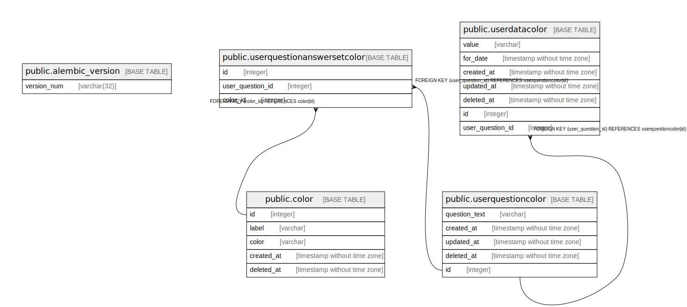

# foo

## Tables

| Name | Columns | Comment | Type |
| ---- | ------- | ------- | ---- |
| [public.alembic_version](public.alembic_version.md) | 1 |  | BASE TABLE |
| [public.color](public.color.md) | 5 |  | BASE TABLE |
| [public.userquestioncolor](public.userquestioncolor.md) | 5 |  | BASE TABLE |
| [public.userdatacolor](public.userdatacolor.md) | 7 |  | BASE TABLE |
| [public.userquestionanswersetcolor](public.userquestionanswersetcolor.md) | 3 |  | BASE TABLE |

## Relations

---

> Generated by [tbls](https://github.com/k1LoW/tbls)
