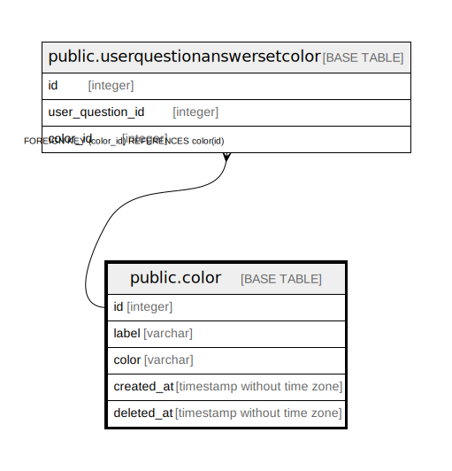

# public.color

## Description

## Columns

| Name | Type | Default | Nullable | Children | Parents | Comment |
| ---- | ---- | ------- | -------- | -------- | ------- | ------- |
| id | integer | nextval('color_id_seq'::regclass) | false | [public.userquestionanswersetcolor](public.userquestionanswersetcolor.md) |  |  |
| label | varchar |  | true |  |  |  |
| color | varchar |  | false |  |  |  |
| created_at | timestamp without time zone |  | false |  |  |  |
| deleted_at | timestamp without time zone |  | true |  |  |  |

## Constraints

| Name | Type | Definition |
| ---- | ---- | ---------- |
| color_pkey | PRIMARY KEY | PRIMARY KEY (id) |

## Indexes

| Name | Definition |
| ---- | ---------- |
| color_pkey | CREATE UNIQUE INDEX color_pkey ON public.color USING btree (id) |
| ix_color_color | CREATE UNIQUE INDEX ix_color_color ON public.color USING btree (color) |

## Relations

---

> Generated by [tbls](https://github.com/k1LoW/tbls)
