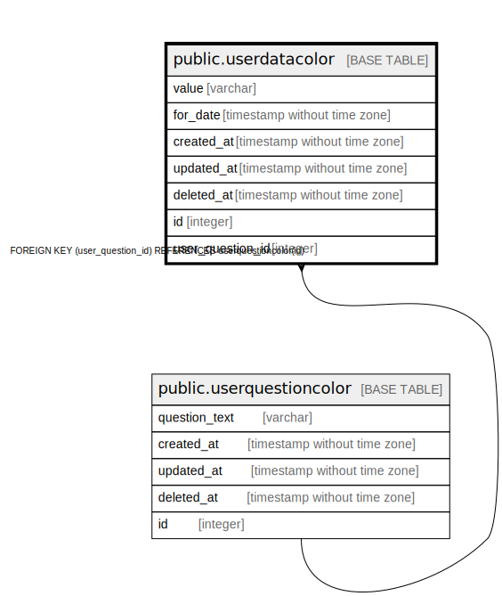

# public.userdatacolor

## Description

## Columns

| Name | Type | Default | Nullable | Children | Parents | Comment |
| ---- | ---- | ------- | -------- | -------- | ------- | ------- |
| value | varchar |  | false |  |  |  |
| for_date | timestamp without time zone |  | false |  |  |  |
| created_at | timestamp without time zone |  | false |  |  |  |
| updated_at | timestamp without time zone |  | true |  |  |  |
| deleted_at | timestamp without time zone |  | true |  |  |  |
| id | integer | nextval('userdatacolor_id_seq'::regclass) | false |  |  |  |
| user_question_id | integer |  | false |  | [public.userquestioncolor](public.userquestioncolor.md) |  |

## Constraints

| Name | Type | Definition |
| ---- | ---- | ---------- |
| userdatacolor_user_question_id_fkey | FOREIGN KEY | FOREIGN KEY (user_question_id) REFERENCES userquestioncolor(id) |
| userdatacolor_pkey | PRIMARY KEY | PRIMARY KEY (id) |

## Indexes

| Name | Definition |
| ---- | ---------- |
| userdatacolor_pkey | CREATE UNIQUE INDEX userdatacolor_pkey ON public.userdatacolor USING btree (id) |

## Relations

---

> Generated by [tbls](https://github.com/k1LoW/tbls)
