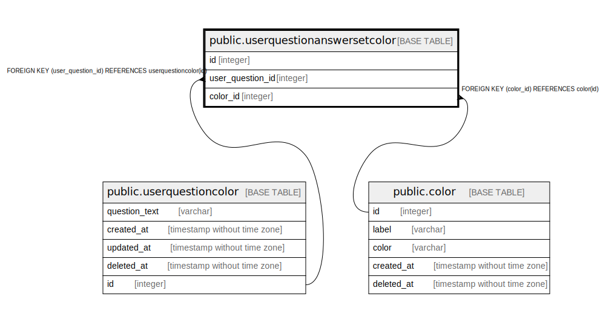

# public.userquestionanswersetcolor

## Description

## Columns

| Name | Type | Default | Nullable | Children | Parents | Comment |
| ---- | ---- | ------- | -------- | -------- | ------- | ------- |
| id | integer | nextval('userquestionanswersetcolor_id_seq'::regclass) | false |  |  |  |
| user_question_id | integer |  | false |  | [public.userquestioncolor](public.userquestioncolor.md) |  |
| color_id | integer |  | false |  | [public.color](public.color.md) |  |

## Constraints

| Name | Type | Definition |
| ---- | ---- | ---------- |
| userquestionanswersetcolor_color_id_fkey | FOREIGN KEY | FOREIGN KEY (color_id) REFERENCES color(id) |
| userquestionanswersetcolor_user_question_id_fkey | FOREIGN KEY | FOREIGN KEY (user_question_id) REFERENCES userquestioncolor(id) |
| userquestionanswersetcolor_pkey | PRIMARY KEY | PRIMARY KEY (id) |

## Indexes

| Name | Definition |
| ---- | ---------- |
| userquestionanswersetcolor_pkey | CREATE UNIQUE INDEX userquestionanswersetcolor_pkey ON public.userquestionanswersetcolor USING btree (id) |

## Relations

---

> Generated by [tbls](https://github.com/k1LoW/tbls)
