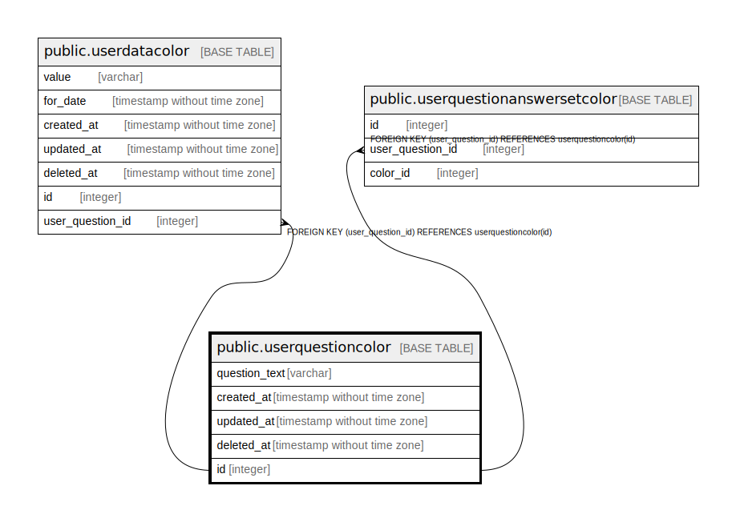

# public.userquestioncolor

## Description

## Columns

| Name | Type | Default | Nullable | Children | Parents | Comment |
| ---- | ---- | ------- | -------- | -------- | ------- | ------- |
| question_text | varchar |  | false |  |  |  |
| created_at | timestamp without time zone |  | false |  |  |  |
| updated_at | timestamp without time zone |  | true |  |  |  |
| deleted_at | timestamp without time zone |  | true |  |  |  |
| id | integer | nextval('userquestioncolor_id_seq'::regclass) | false | [public.userdatacolor](public.userdatacolor.md) [public.userquestionanswersetcolor](public.userquestionanswersetcolor.md) |  |  |

## Constraints

| Name | Type | Definition |
| ---- | ---- | ---------- |
| userquestioncolor_pkey | PRIMARY KEY | PRIMARY KEY (id) |

## Indexes

| Name | Definition |
| ---- | ---------- |
| userquestioncolor_pkey | CREATE UNIQUE INDEX userquestioncolor_pkey ON public.userquestioncolor USING btree (id) |

## Relations

---

> Generated by [tbls](https://github.com/k1LoW/tbls)
